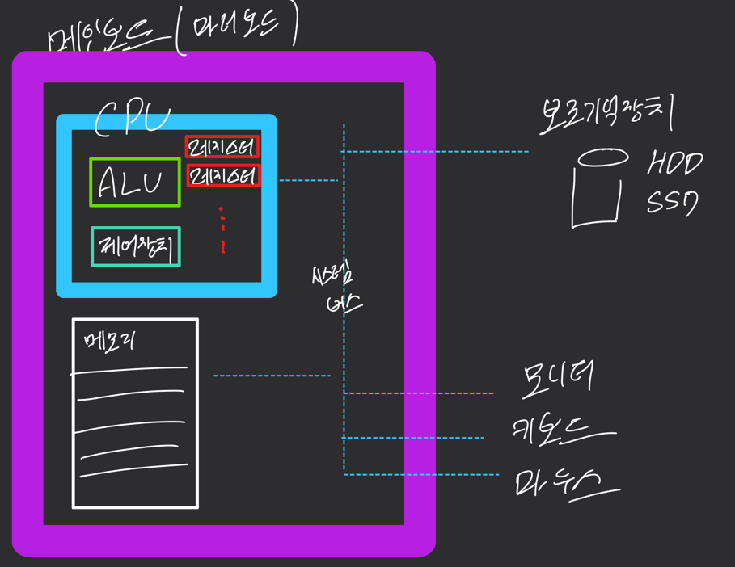

# 컴퓨터구조 ch01 오리엔테이션

### 프로그램을 이루는 두 정보

1. 명령어 (instruction) : 컴퓨터를 동작시키는 실질적인 정보
2. 데이터 (data) : 명령어의 대상

### 네가지 핵심 부품
1. cpu
   - 명령어 해석, 실행 담당 장치 (fetch, execute)
2. 메인 메모리 & 캐시 메모리
   - 실행 중인 프로그램(프로세스) 저장하는 장치
   - 전원이 꺼지면 삭제 (휘발성)
3. 보조기억장치
   - 보관할 프로그램 저장할 장치
   - 전원이 꺼져도 유지
4. 입출력장치
   - 컴퓨터 내외부와 정보를 주고받는 장치 

#### CPU
1. 레지스터 : 연산결과 임시 저장 장치 (여러개, register set)
2. ALU : 계산기 회로
3. 제어장치 : 명령어 해석, 제어신호 (메모리 읽기, 쓰기)

#### 메인 메모리 : 주소를 갖는다

메인보드(마더보드) : 핵심 부품을 연결할 기판

(시스템) 버스 : 부품간 정보를 주고받을 통로

