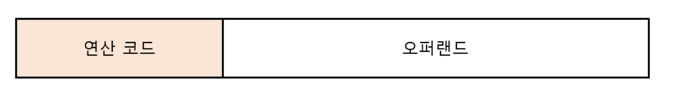
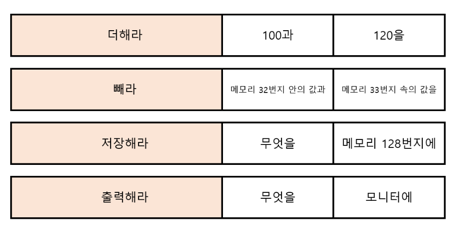
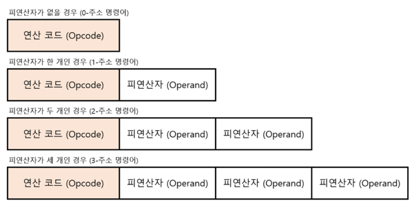
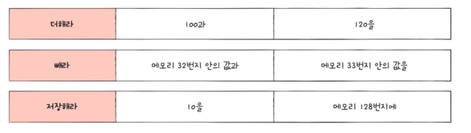
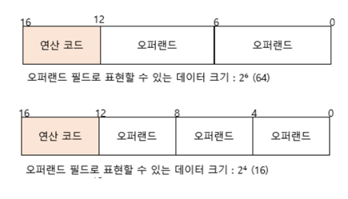
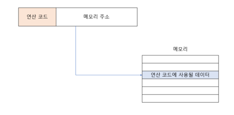
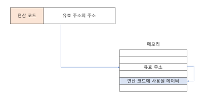
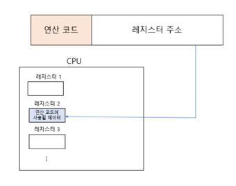
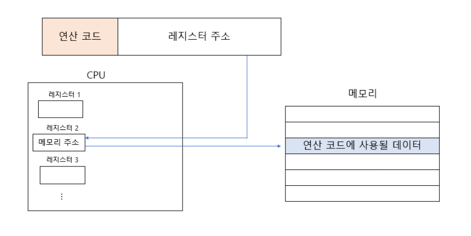

# 컴퓨터구조 ch02 명령어

컴퓨터는 소스 코드를 곧장 이해할 수 있을까?
- 명령어를 이해
- 소스코드는 실행되기 전 -> (명령어 + 데이터) 로 변환되어 실행
- 소스코드 : 사람이 이해하기 편한 언어 (고급 언어)
- 명령어 + 데이터 : 저급 언어

고급 언어 -> 저급 언어(기계어, 어셈블리어) + data


### 컴파일, 인터프리트
1. 컴파일
   - 컴파일러에 의해 검사, 목적 코드(오브젝트 코드)로 변환
   - 문법검사, 불필요한 코드, 성능개선...


2. 인터프리트
   - 소스 코드 한줄씩 인터프리터에 의해 검사, 목적 코드로 변환

### 실습 (X86-64 gcc 15.1)

```c
#include <stdio.h>

int main(){
    int a = 1;
    int b = 2;
    int c = a + b;
    printf("%d\n",c);
    return 0;
}
```

```text
.LC0:
        .string "%d\n"
main:
        push    rbp
        mov     rbp, rsp
        sub     rsp, 16
        mov     DWORD PTR [rbp-4], 1
        mov     DWORD PTR [rbp-8], 2
        mov     edx, DWORD PTR [rbp-4]
        mov     eax, DWORD PTR [rbp-8]
        add     eax, edx
        mov     DWORD PTR [rbp-12], eax
        mov     eax, DWORD PTR [rbp-12]
        mov     esi, eax
        mov     edi, OFFSET FLAT:.LC0
        mov     eax, 0
        call    printf
        mov     eax, 0
        leave
        ret
```

### 명령어의 구조
명령어 : 컴퓨터를 동작시키는 실질적인 정보
- 무엇을 대상으로 무엇을 수행하라
- 오퍼랜드를 대상으로 연산코드를 수행하라
- 피연산자(operand) : 명령어를 수행할 대상
  - 대상이 직접 명시되기도 하고, **위치**가 명시되기도 함
- 연산 코드(op-code) : 오퍼랜드를 수행할 동작







데이터 전송
- MOVE : 데이터를 옮겨라 
- STORE : 메모리에 저장해라
- **LOAD(FETCH) : 메모리에서 가져와라**
- PUSH : 스택 최상단에 데이터를 저장하라
- POP : 스택 최상단의 데이터를 가져와라

산술/논리 연산
- ADD, SUBSTRACT, MYLTIPLY, DIVIDE : 덧셈, 뺄셈, 곱셈, 나눗셈 을 수행하라
- INCREMENT, DECREMENT : 1 증가, 감소 시켜라
- AND, OR, NOT
- COMPARE : 두 숫자 또는 TRUE/FALSE 값을 비교하라

제어 흐름 변경
- JUMP : 특정 주소로 실행 순서를 옮겨라
- CONDITIONAL JUMP : 조건에 부합할 경우 특정 주소로 실행 순서를 옮겨라
- HALT : 프로그램 실행을 멈춰라
- CALL : 되돌아올 주소를 저장한 채 특정 주소로 실행 순서를 옮겨라
- RETURN : CALL 호출 시 지정했던 주소로 돌아가라
  - CALL,RETURN ~= 함수호출,반환

입출력 제어
- READ(INPUT) : 특정 입출력장치로부터 데이터를 읽어라
- WRITE(OUTPUT) : 특정 입출력장치로 데이터를 써라
- START IO : 입출력장치를 시작하라
- TEST IO : 입출력장치의 상태를 확인하라

### 명령어의 주소 지정
- 오퍼랜드(operand) : 명령어를 수행할 대상
  - 데이터가 직접 명시되기도 하고, 대상의 위치가 명시되기도 함



왜 데이터를 직접 명시하지 않고 위치를 명시할까?
- 명령어의 길이가 한정되어 있기 때문



#### 유효 주소 
- 연산 코드에 사용할 데이터가 저장된 위치

- 레지스터 접근속도 (빠르다)
- 메모리 접근 속도 (비교적 느리다)

#### 즉시 주소 지정
- 연산에 사용할 데이터를 오퍼랜드 필드에 직접 명시
- 가장 빠른 주소지정 + 데이터 크기 제한

#### 직접 주소 지정
- 오퍼랜드 필드에 유효 주소(연산에 사용될 데이터가 저장된 메모리 주소 명시)
- 오퍼랜드 필드로 표현 가능한 메모리 주소 크기에 제한



#### 간접 주소 지정
- 오퍼랜드 필드에 유효 주소 
- 유효 주소 크기에 제한은 없으나, 속도가 비교적 느림



#### 레지스터 주소 지정
- 연산에 사용할 데이터를 저장한 레지스터를 오퍼랜드 필드에 명시
- **레지스터 접근은 메모리보다 빠르다**



#### 레지스터 간접 주소 지정
- 연산에 사용할 데이터를 메모리에 저장
- 그 주소를 저장한 레지스터를 오퍼랜드 필드에 명시
- **메모리 접근 한 번**


