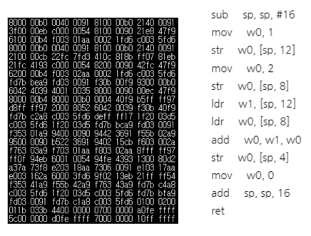
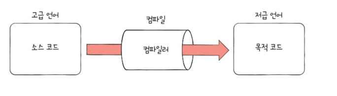

# 컴퓨터구조 ch02 명령어

컴퓨터는 소스 코드를 곧장 이해할 수 있을까?
- 명령어를 이해
- 소스코드는 실행되기 전 -> (명령어 + 데이터) 로 변환되어 실행
- 소스코드 : 사람이 이해하기 편한 언어 (고급 언어)
- 명령어 + 데이터 : 저급 언어

고급 언어 -> 저급 언어(기계어, 어셈블리어) + data
ㅌ
### 컴파일, 인터프리트
1. 컴파일
   - 컴파일러에 의해 검사, 목적 코드(오브젝트 코드)로 변환
   - 문법검사, 불필요한 코드, 성능개선...

2. 인터프리트
   - 소스 코드 한줄씩 인터프리터에 의해 검사, 목적 코드로 변환

### 실습 (X86-64 gcc 15.1)

```c
#include <stdio.h>

int main(){
    int a = 1;
    int b = 2;
    int c = a + b;
    printf("%d\n",c);
    return 0;
}
```

```text
.LC0:
        .string "%d\n"
main:
        push    rbp
        mov     rbp, rsp
        sub     rsp, 16
        mov     DWORD PTR [rbp-4], 1
        mov     DWORD PTR [rbp-8], 2
        mov     edx, DWORD PTR [rbp-4]
        mov     eax, DWORD PTR [rbp-8]
        add     eax, edx
        mov     DWORD PTR [rbp-12], eax
        mov     eax, DWORD PTR [rbp-12]
        mov     esi, eax
        mov     edi, OFFSET FLAT:.LC0
        mov     eax, 0
        call    printf
        mov     eax, 0
        leave
        ret
```

### 명령어의 구조
