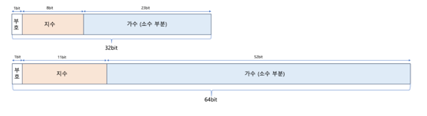
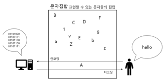

# 컴퓨터구조 ch03 데이터

### 이진수와 2의 보수법
컴퓨터는 0과 1만을 이해한다. 양수? 음수? 소수? 문자? 어떻게 이해할까?
- 양수 표현 : 이진수
- 음수 표현 : 2의 보수
- 소수 표현 : 부동 소수점
- 문자 표현 : 문자 집합 & 인코딩

### 이진법(이진수)
- 이진법 : 0과 1로 모든 수를 표하는 방법
- 이진수 : 0과 1만으로 표현된 수
- 1 = 1, 2 = 10, 3 = 11, 4 = 100 ...
- 십육진법(십육진수)
  - 1~9 + A~F 로 모든 수를 표기
  - 10 = A, 15 = F, 16 = 10

### 2의 보수법
- 0과 1만으로 음수를 표현하는 방법 중 하나
- 어떤 수 n 을 그보다 큰 2^n 에서 뺀 값
  - 11의 보수
  - 100 - 11 = 01
- 모든 0과 1을 뒤집은 뒤, 1을 더한 값
  - 1011 -> 0100 + 1 -> 0101

어떻게 양수와 음수를 구분할까?
- CPU 내부 정보, 플래그 (flag) 사용
- flag : CPU 가 명령어를 실행하는 과정에서 참고할 정보의 모음
- 음수 플래그 세팅 : 음수
- 음수 플래그 세팅 X : 양수

### 부동소수점
소수점 더하기 테스트

```java
public class FloatingPointComparison {

    public static void main(String[] args) {
        double a = 0.1;
        double b = 0.2;
        double c = 0.3;

        if (a + b == c) {
            System.out.println("같다");
        }else {
            System.out.println("다르다");
        }
    }

}
```
결과 : `다르다`

#### 123.123 십진수를 m * 10^n 꼴로 나타낸다면?
- 1.123123 * 10^2 -> 1.23123(가수), 2(지수)
- 1231.23 * 10^-1

#### 1101011.1010101 이진수를 m X 2^n 꼴로 나타낸다면?
- 1.1010111010101 X 2^6
- 110101110.10101 X 2^-2

#### 부동 소수점 표현 방식(컴퓨터의 소수 표현 방식)
- 이진수를 m * 2^n 꼴로 나타내고, 가수 부분은 1.xxx(소수 부분만 저장) 꼴로 나타낸다
- 1.1010111010101 X 2^6
- 



#### 문제 발생
십진수 소수를 이진수로 표현할 때 십진수 소수와 이진수 소수 표현이 딱 맞아 떨어지지 않을 수 있다
- 1/3이라는 분수 m X 3^n 꼴로 표현하면 딱 떨어진다
- 1/3이라는 분수 m X 10^n 꼴로 표현하면 무한히 많은 가수가 필요하다 (0.33333333333.....)
- 위 처럼
  - 1/10이라는 분수 m X 10^n 꼴로 표현하면 딱 떨어진다
  - 1/10이라는 분수 m X 2^n 꼴로 표현하면 무한히 많은 가수가 필요하다

### 문자 인코딩
#### 0과 1로 문자 표현하기
- 문자 집합: 표현 가능한 문자들의 집합
• 문자 인코딩: 문자를 0과 1로 이루어진 문자 코드로 변환
• 문자 디코딩: 0과 1로 이루어진 문자 코드를 문자로 변환



#### 아스키 코드
- 초창기 문자 집합, 알파벳 + 아라비아 숫자 + 일부 특수 문자 + 제어 문자
- 8bit : 1비트는 오류검출, 7비트 128개의 문자
- A : 65, a : 97

#### 유니코드 문자 집합
- 대부분의 언어, 특수문자, 이모티콘, 화살표
- **코드 포인트** : 유니코드문자에부여된고유한수, u+(코드포인트)
- 코드 포인트를 인코딩하는 방식에 따라 utf-8, utf-16, utf-32 등으로 나뉨

```text
인코딩할 값을 입력하세요: 이승현
유니코드 코드 포인트:
문자 '이' : U+C774
문자 '승' : U+C2B9
문자 '현' : U+D604
UTF-8 인코딩 결과: EC 9D B4 EC 8A B9 ED 98 84
UTF-16 인코딩 결과: FE FF C7 74 C2 B9 D6 04
```
