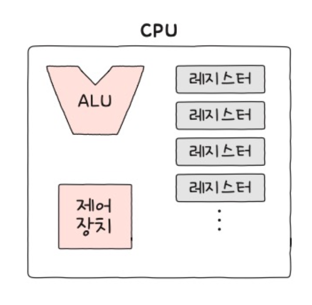
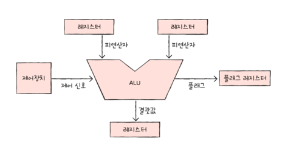

# 컴퓨터구조 ch04 CPU의 구성 요소

- ALU : 연산을 수행하는 장치
- 제어 장치 : 명령어를 해석하고 제어 신호를 보내는 장치
- 레지스터(들) : 명령어 처리 전후로 값을 임시 저장하는 장치
    - cpu 마다 이름, 갯수가 달라질 수 있다

#### ALU
- 레지스터로 부터 피연산자(연산의 대상)를 받아들이고
- 제어 장치로부터 제어 신호를 받아들인다
- 연산의 결과를 레지스터, 플래그 레지스터에 저장한다

#### 
