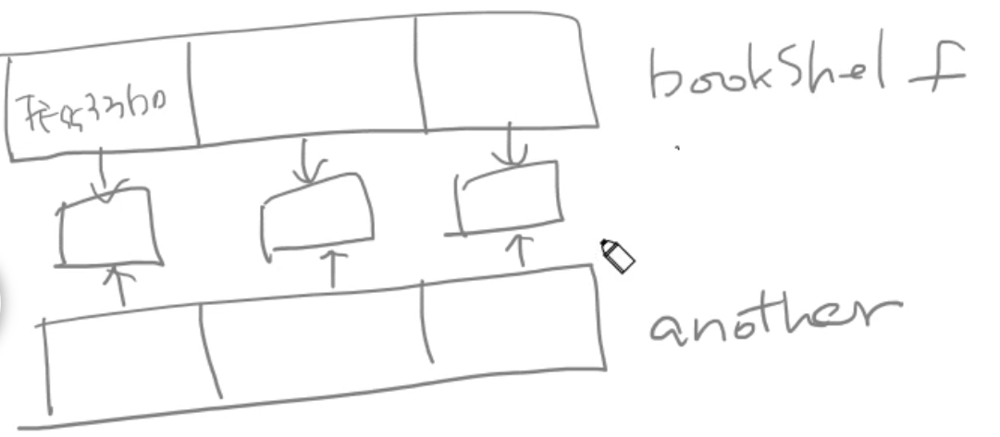
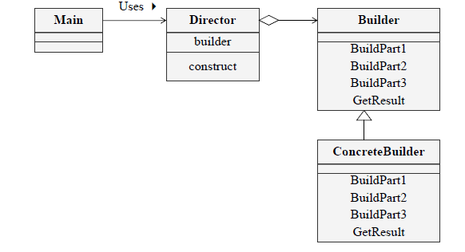

# 인스턴스 생성 패턴
## 싱글턴 패턴
- 클래스의 **인스턴스는 오직 하나임을 보장**하며 이 인스턴스에 접근할 수 있는 방법을 제공하는 패턴
- 여러개의 인스턴스가 있을 때 문제가 발생 가능하다면 사용
- 각각의 인스턴스가 다른 프로퍼티의 값을 가질 필요가 없을 때
- ConnectionPool 처럼 ~

### 클래스 다이어그램


### 객체 협력
클라이언트는 Singleton 클래스에 정의된 public 오퍼레이션을 통해 유일하게 생성되는 Singleton 인스턴스에 접근 가능

## 프로토 타입 패턴
- 복제해서 인스턴스를 만드는 패턴
  - 클래스의 인스턴스 생성과정이 복잡하거나 여러 조합에 의해 생성되어야 하는경우 하나의 견본(Prototype)을 만들어 초기화해두고 복제해서 객체를 생성하는 방법
  -  객체 생성 비용이 클 때, 객체를 매번 new로 만들기에는 비용이 큰 경우 (예: DB 조회, 복잡한 연산, 네트워크 요청 등)
  - 자바는 Object.clone() 을 이용해 구현할 수 있다
  - 
### 구현
오버라이드한 clone() 메서드 사용시 발생하는 에러문
```text
Exception in thread "main" java.lang.CloneNotSupportedException: 인스턴스_생성_패턴.prototype.BookShelf
	at java.base/java.lang.Object.clone(Native Method)
	at 인스턴스_생성_패턴.prototype.BookShelf.clone(BookShelf.java:35)
	at 인스턴스_생성_패턴.prototype.PrototypeTest.main(PrototypeTest.java:15)
```

#### Cloneable 적용
**마크 인터페이스** Cloneable 을 복제할 클래스에서 구현해야한다
`public class BookShelf implements Cloneable` 적용

```java
public interface Cloneable {
}
```
```text
아무 메서드도 담고 있지 않고, 단지 자신을 구현하는 클래스가 특정 속성을 가짐을 표시해주는 인터페이스를 마커 인터페이스(marker interface)라 한다.

– 이펙티 자바 3/E. 아이템 41.
```

- 필요한 이유?
  - 모든 객체가 clone()을 가질 수 있지만, 개발자가 복제를 허용하지 않는 경우도 있기 때문
  - 인터페이스로 명시적으로 구현하게 해서 "이 클래스는 복제해도 안전하다" 라는 의도를 드러냄

#### 얕은 복사
- clone() 메서드는 기본적으로 얕은 복사를 지원하기 때문에 참조 타입이 있으면 주소만 복사하므로 같은 객체를 공유하게됨
```java
bookShelf.getShelf().get(0).setAuthor("조정래");
bookShelf.getShelf().get(0).setTitle("한강");

System.out.println(bookShelf);
System.out.println(another);
```
```text
BookShelf{shelf=[Book{author='조정래', title='한강'}, Book{author='남궁성', title='자바의 정석'}, Book{author='문병로', title='쉽게 배우는 자료구조'}]}
BookShelf{shelf=[Book{author='조정래', title='한강'}, Book{author='남궁성', title='자바의 정석'}, Book{author='문병로', title='쉽게 배우는 자료구조'}]}
```



- 따로 관리를 하도록 복제를 하려면??
- 리스트를 돌면서 Book 인스턴스를 새로 생성해서 넣어줘야한다

깊은 복사가 제대로 이루어진 것을 확인할 수 있다
```text
BookShelf{shelf=[Book{author='조정래', title='한강'}, Book{author='남궁성', title='자바의 정석'}, Book{author='문병로', title='쉽게 배우는 자료구조'}]}
BookShelf{shelf=[Book{author='조정래', title='태백산맥'}, Book{author='남궁성', title='자바의 정석'}, Book{author='문병로', title='쉽게 배우는 자료구조'}]}
```

#### 추가
1. 얕은 복사 (Shallow Copy)
- 객체의 필드 값을 그대로 복사하는 방식
- Primitive 타입은 값 자체가 복사됨 → 원본과 독립적
- Reference 타입은 참조 주소만 복사됨 → 원본과 같은 객체를 공유
2. 깊은 복사 (Deep Copy)
- 객체뿐 아니라, 그 객체가 가진 참조 타입 필드가 가리키는 객체까지 새로 복사하는 방식
- 원본과 복제본이 전혀 다른 객체를 가지므로 서로 영향을 주지 않음

## 빌더 패턴


### GOF 빌더패턴
- 생성에 대한 과정과 각 결과물을 표현하는 방법을 분리하여 동일한 생성 과정에 서로 다른 여러 결과물이 나올 수 있도록 함
- 복잡한 문서 생성기 (HTML, PDF, Markdown 같은 서로 다른 포맷을 같은 절차로 생성)
- 클라이언트 코드는 Builder가 제공하는 메서드를 기반으로 원하는 결과물을 얻을 수 있음
- Builder: 객체를 만드는 추상 인터페이스
- ConcreteBuilder: 구체적으로 객체 생성하는 클래스
- Director: Builder를 사용해서 생성 절차(순서)를 지휘
- Product: 완성된 객체

#### 결론
- 생성과정과 구현을 분리함 (동일한 생성 과정에 서로 다른 여러 결과물이 나올 수 있도록 함)
- 제품의 다양한 구현이 가능
- 제품의 생산 과정을 더 세분화 할 수 있음
- 클라이언트는 구체적인 사항을 알 필요가 없음

### Effective Java 빌더 패턴
- 객체를 생성할 때 매개 변수가 여러개인 경우 각각의 매개 변수가 점점 늘어나는 여러 개의 생성자를 사용하기 보다는
- 인스턴스 생성을 위한 Builder를 제공함으로써, 오류를 방지하고 이후 매개 변수가 늘어나더라도 유연하게 수정할 수 있는 구조를 제공한다.
