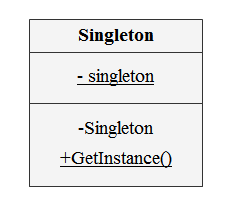

# 인스턴스 생성 패턴
## 싱글턴 패턴
- 클래스의 **인스턴스는 오직 하나임을 보장**하며 이 인스턴스에 접근할 수 있는 방법을 제공하는 패턴
- 여러개의 인스턴스가 있을 때 문제가 발생 가능하다면 사용
- 각각의 인스턴스가 다른 프로퍼티의 값을 가질 필요가 없을 때
- ConnectionPool 처럼 ~

### 클래스 다이어그램

### 객체 협력
클라이언트는 Singleton 클래스에 정의된 public 오퍼레이션을 통해 유일하게 생성되는 Singleton인스턴스에 접근 가능

