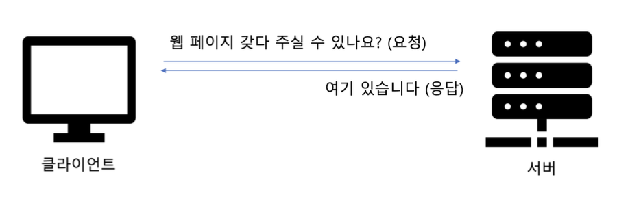
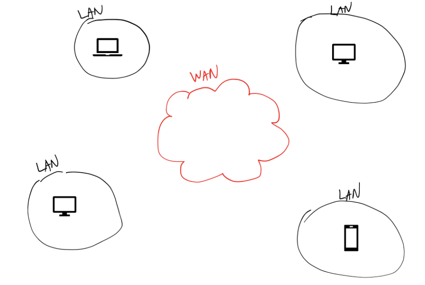
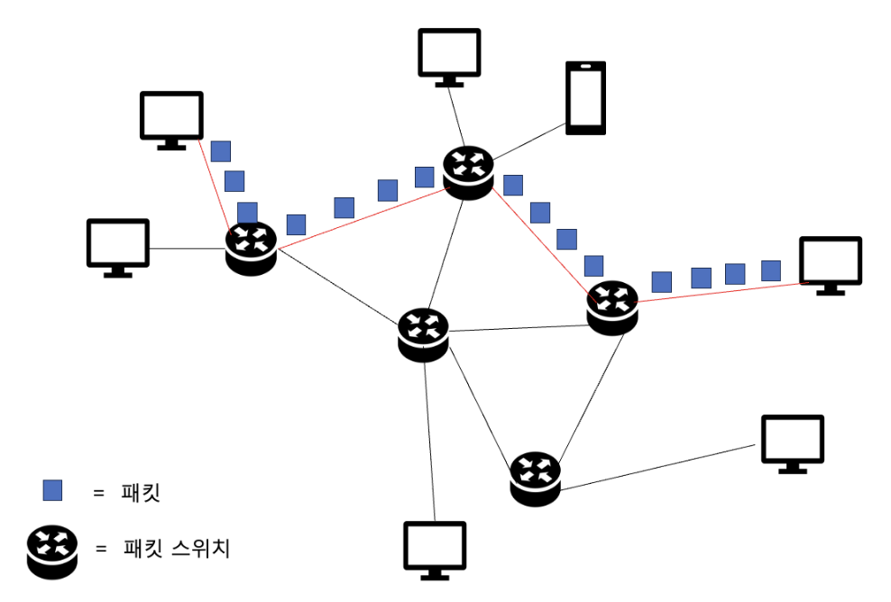
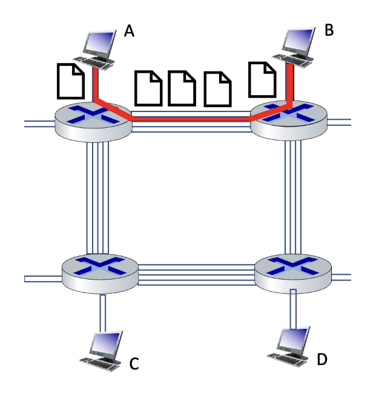
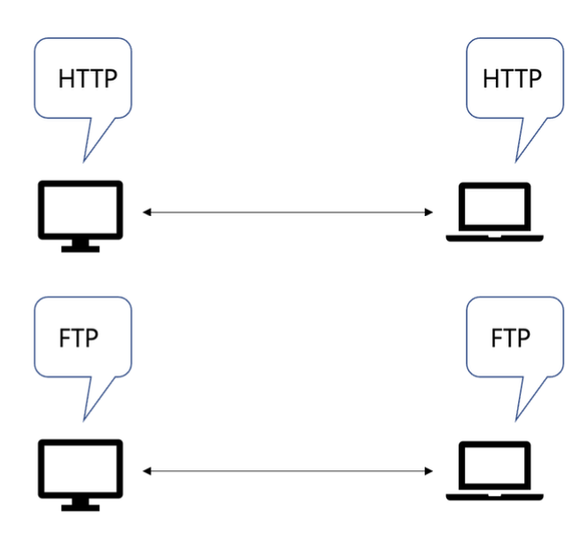
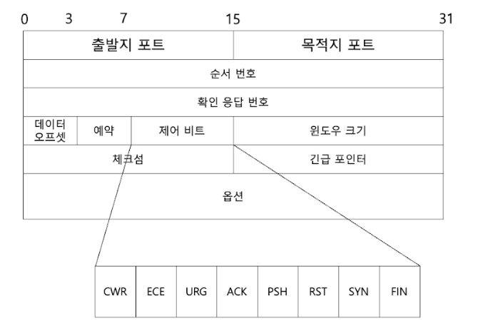
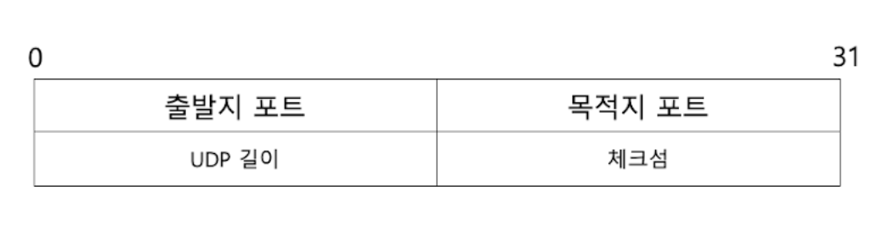
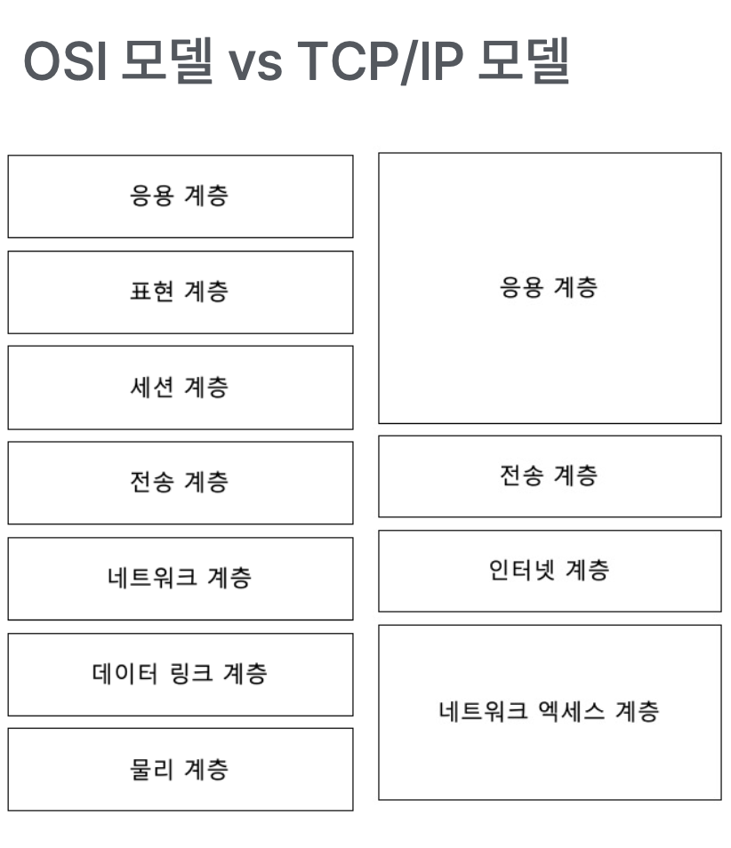
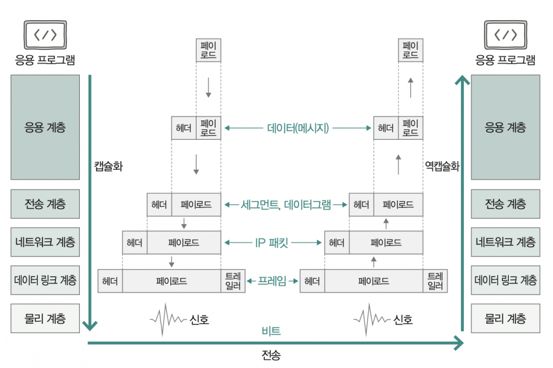

# 01. 네트워크 거시적으로 보기

컴퓨터 네트워크 : 여러 장치들이 서로 정보를 주고 받을 수 있는 통신망

인터넷 : 네트워크의 네트워크

구성요소 : 노드, 메세지, 간선(통신 링크)
### 노드
- 종단 시스템, 호스트
- **메세지를 최초로 송신, 생성하는 대상**
- **주소** 를 통해 위치 특정
- 유니캐스트
    - 1:1 통신 (이메일, 1대1 채팅)
- 브로드캐스트
    - 네트워크의 모든 대상에 통신
- 멀티캐스트
    - 특정 그룹에게만 메시지 통신

서버와 클라이언트
- 클라이언트 : 요청을 보내는 호스트
- 서버 : 응답을 보내는 호스트

  
  중간 노드
- 네트워크 장비
- 라우터, 스위치, 공유기…

### 간선 (통신 링크)
유선 케이블(트위스티드 페어 케이블, 광케이블),  무선(와이파이)

### 메세지
주고받는 정보 (웹 페이지, 사진, 동영상 …)

### LAN, WAN
- LAN : 근거리 연결 네트워크 (사무실, 가정)
- WAN : 원거리를 연결한 네트워크 (인터넷 서비스)
    - ISP : InternetServiceProvider에 의해 구축 (KT,LG U+,SK 브로드밴드…)

      
# 프로토콜과 캡슐화

### 패킷 교환 네트워크 (packet)
주고받는 정보를 패킷 단위로 주고받는 네트워크

### 회선 교환 네트워크
정해진 회선으로만 통신하는 네트워크 (전통적인 전화망)

사전에 연결 수립 작업, 다른 호스트는 도중에 끼어들 수 없음
- 장점 : 전송률 보장
- 단점 : 회선 이용률 저하

### 패킷 구성 요소
- 헤더(header ) : 패킷에 붙일 부가 정보
- 페이로드(payload) : 패킷에 보낼 정보
- 트레일러(trailer) : 패킷 뒤에 붙일 부가 정보

### 프로토콜
장비 간 정보를 주고받을 **규칙이나 방법**
호스트 간 합의된 의사 소통 규칙

헤더의 내용은 프로토콜의 영향을 받는다
프로토콜이 달라지면 헤더의 내용이 달라질 수 있다
#### TCP

#### UDP

### 캡슐화(encapsulation)
상위 계층으로부터 내려받은 패킷을 페이로드로 삼아,

상위 계층으로부터 받은 정보에 프로토콜에 걸맞는 헤더(혹은 트레일러)를 덧붙이는 것

데이터 -> 세그먼트(TCP), 데이터그램(UDP) -> IP 패킷 -> 프레임 -> 비트

### WIRESHARK
https://github.com/kangtegong/fastcampus-cs/tree/main/net

### 네트워크의 성능
**트래픽**
- 특정 시간 동안 네트워크 내 정보 흐름
    - 트래픽이 몰린다!
    - 트래픽을 분산한다!
- 얼마나 많은 패킷들이 한 순간 몰리는가

전송속도 : 기대 가능한 속도
bps (bit per second), Mbps(Mb/s), Gbps(Gb/s)

처리율(Throughput) : 단위 시간 동안 네트워크를 통해 전송되는 데이터 양
bps (bit per second), Mbps(Mb/s), Gbps(Gb/s)

대역폭 (bandwith)
- 네트워크 트래픽을 수용할 수 있는 용량 (송수신 가능한 최대 데이터 양)
- 전송 매체 두께

패킷 손실(packet loss) : 얼마나 많은 패킷이 송수신 과정에서 유실되었는가
