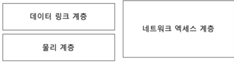
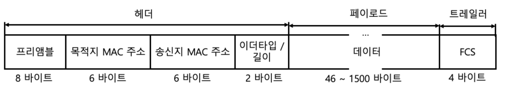
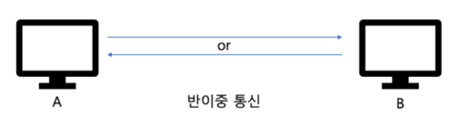
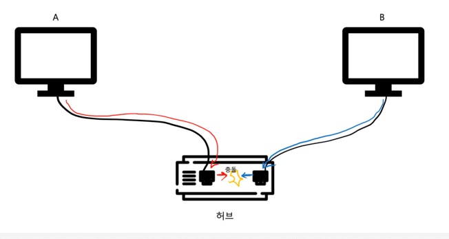
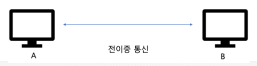

# 네트워크 엑세스 계층
- 물리 계층, 데이터링크 계층
- 근원적인 통신이 이루어지는 지점

## 1. 이더넷 (국제 표준 : IEEE 802.3)
- **LAN** : 이더넷
- **WAN** : 인터넷
- 현대 LAN 에서 가장 대중적으로 사용되는 기술
- 물리 계층, 데이터 링크 계층 (네트워크 엑세스 계층) 스펙/프로토콜 정의
  - 물리 계층 : 통신 가능한 케이블
  - 데이터 링크 : 이더넷 프레임

(물리계층)

이더넷 표준 규격이 달라지면 케이블, 전송 속도 등이 달라질 수 있다
- 케이블 사양도 프로그램의 성능에 영향을 준다

| 표준규격   | 전송속도   | 연결 매체 종류        |
|------------|-----------|----------------------|
| 802.3ab    | 1Gbit/s   | 트위스트 페어 케이블 |
| 802.3u     | 100Mbit/s | 트위스트 페어 케이블 |
| 802.3ae    | 10Gbit/s  | 멀티 모드 광 케이블  |
| 802.3cc    | 25Gbit/s  | 싱글 모드 광 케이블  |

이더넷 케이블을 지칭할 때 : **전송속도 BASE - 추가특성**
- 10BASE-T (10Mbps)
- 25GBASE-LR (25000Mbps)
- 5GBASE-T

**추가특성**
- C : 동축 케이블
- T : 트위스티드 페어 케이블
- S : 멀티 모드 광 케이블
- L : 싱글 모드 광 케이블

---

(데이터링크)
### 이더넷 프레임 : 이더넷 네트워크에서 주고받는 데이터 형식

- 프리앰블
  - 이더넷 프레임의 시작을 알리는 비트열, 송수신간의 동기화

- **목적지/송신지 MAC 주소**
  - 물리적 주소, 네트워크 장치(NIC) 마다 할당된 고유한 주소
  - 네트워크 세상의 주민등록번호!!
  - NIC
    - 연결 매체를 통해 받은 신호를 컴퓨터에게 전달
    - 네트워크에 연결하기 위한 하드웨어
    - 목적지 MAC주소를 통해 프레임 판단/폐기
- 이더타입/길이
  - 1536 이상 : 이더타입 (프레임이 무엇을 캡슐화 했는지)
    - 0800 -> IPv4
    - 86DD -> IPv6
    - 0806 -> ARP
    - ...
  - 1500 이하 : 프레임 크기
- 페이로드
  - 운반할 데이터 (네트워크 계층에서 전달받은)
- FCS
  - 오류 검출을 위한 CRC 값이 명시되는 필드

## 2. 허브와 CSMA/CD

### 허브
- 물리계층의 장비
- MAC 주소를 사용하지 않는다 (MAC 주소는 데이터 링크 계층)
- 호스트를 연결할 수 있는 포트
- 주소 개념이 없기 때문에 모든 포트로 정보를 내보냄
- 오늘날은 별로 사용하지 않는다
- 반 이중 통신

#### **반 이중 통신(half-duplex)**
송신 혹은 수신이 한 번에 한 번만 이루어지는 통신 (Ex.무전기)
- 동시에 허브로 데이터를 전송할 경우 **충돌(collision)**  발생
- 콜리젼 도메인 
  - 충돌이 발생할 수 있는 범위 
  - (허브에 연결되어있는 모든 호스트)

#### 반이중 이더넷의 충돌을 해결하기 위한 CSMA/CD
1. CS : Carrier Sense
   - 캐리어(반송파) 감지 : 메세지 전송 전 현재 전송 중인지 확인
2. MA : Multiple Access
   - 다중 접근: 두 개 이상의 호스트가 동시에 네트워크에 접근 (충돌 발생)
3. CD : Collision Detection
   - 충돌 감지: 잼 신호(jam signal)를 보낸 뒤 임의의 시간 동안 대기 후 재전송
   
#### **전 이중 통신(full-duplex)**
송신과 수신이 동시에 이루어지는 통신 (Ex.전화)

#### 허브의 특성 정리
- 전달 받은 신호를 모든 포트로 내보냄
- 연결된 모든 호스트가 충돌 도메인
- 반이중 모드로 통신
- 물리 계층의 장비

## 3. 스위치와 VLAN
#### 스위치 
- 전달 받은 신호를 목적지 포트로만 내보내고
- 목적지 호스트가 연결된 곳만 충돌 도메인에 속해 있다
- 전이중 모드로 통신
- 데이터 링크 계층의 장비 (MAC 주소 이해)
- CSMA/CD 가 필요 없다

**MAC 주소 학습기능**
- 포트에 연결된 호스트와 MAC주소의 관계를 기억하는 스위치 기능
- 
